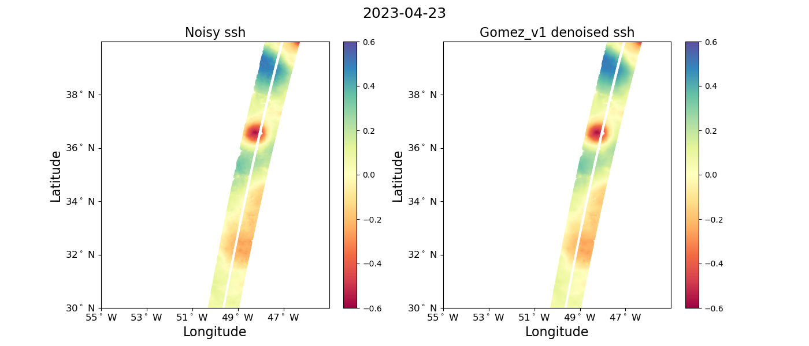
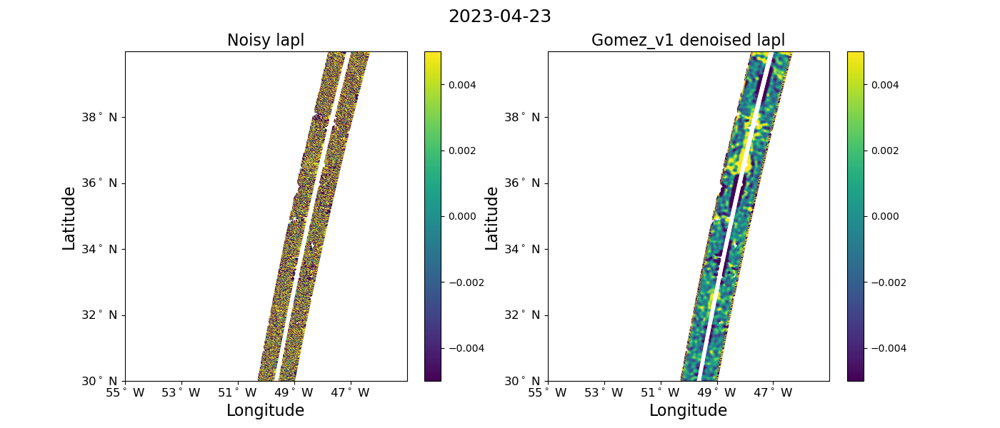
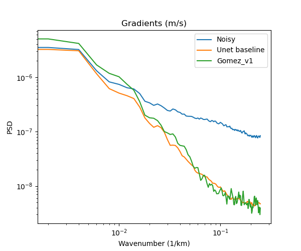
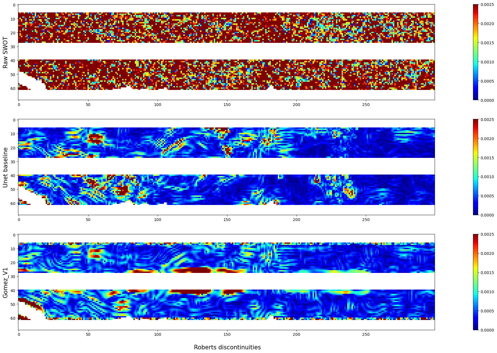
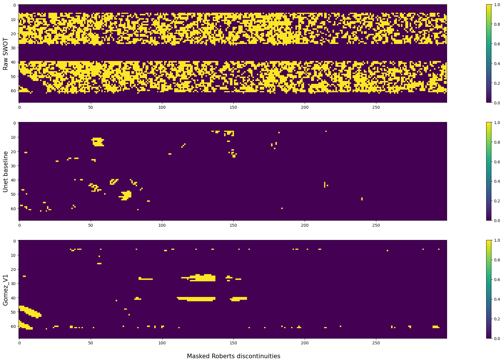

# Gulf Stream region

 

## Snapshots
 

**SSH**
 
| | | 
|------------|--------------|

**Gradients of SSH**

| | | 
|------------|--------------|

**Laplacian of SSH** 

| | | 
|------------|--------------|

 
 

## Movies
 
 
**SSH**
  
  
<video controls width="500">
  <source src="https://github.com/ocean-data-challenges/2024b_DC_SWOTdenoising/assets/33433820/43aad547-ae4f-4b04-bc82-5e1f52713fe3" type="video/mp4" /> 
  
</video>

  
<video controls width="500">
  <source src="https://github.com/ocean-data-challenges/2024b_DC_SWOTdenoising/assets/33433820/a2dfc3b6-5a11-4128-a819-8de1797202e6" type="video/mp4" /> 
  
</video>
 
 

**Gradients of SSH** 

<video controls width="500">
  <source src="https://github.com/ocean-data-challenges/2024b_DC_SWOTdenoising/assets/33433820/68f629ce-5e69-4281-ad21-abf1245f046e" type="video/mp4" /> 
  
</video>

<video controls width="500">
  <source src="https://github.com/ocean-data-challenges/2024b_DC_SWOTdenoising/assets/33433820/8201d804-1b2d-4b7f-81b0-a325c4e06cd2" type="video/mp4" /> 
  
</video>
 

**Laplacian of SSH** 

<video controls width="500">
  <source src="https://github.com/ocean-data-challenges/2024b_DC_SWOTdenoising/assets/33433820/d650496d-6631-4bb8-bfc7-f8d45d756938" type="video/mp4" /> 
  
</video>

<video controls width="500">
  <source src="https://github.com/ocean-data-challenges/2024b_DC_SWOTdenoising/assets/33433820/2644d0e4-30b0-42ca-9672-d7ca085f1f5b" type="video/mp4" /> 
  
</video>
 
 

 
## Physical pdf

| **SSH** | **Gradients of SSH** | **Laplacian of SSH** |
|----|----|----|
|  | |  |

 
 

## Power Spectrum Density

| **SSH** | **Gradients of SSH** | **Laplacian of SSH** |
|----|----|----|
|  | |  |

## Roberts discontinuities

| **SSH** | **Gradients of SSH** |  
|----|----| 
|  | | 
| **Roberts discontinuities** | **Masked Roberts discontinuities** |  
|  |  | 

**Total discontinuity percentages**

- Raw SWOT discontinuities: **29.3 %**
- Unet baseline discontinuities: **1.5 %**
- Gomez_V1 discontinuities: **1.6 %**

| **Discontinuities function of SWH** |   
|----| 
|  |

| **Discontinuities spatial distribution** |  
|----| 
| |
  