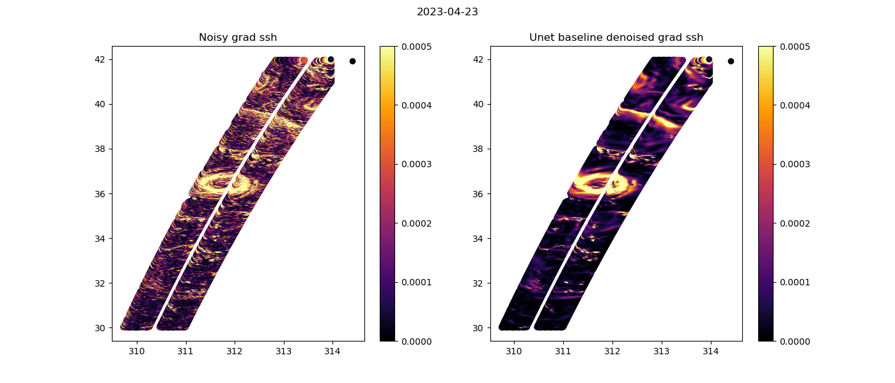

# Visualisation

 
 

 
 

## Snap shots
 

### 1 day orbit - Gulf Stream example

**SSH**

**Gradients of SSH**

 

**Laplacian of SSH** 

  

### 21 day orbit - Gulf Stream example
 
**SSH**

   

**Gradients of SSH** 
  
   

**Laplacian of SSH** 
 
   

 

## Movies
 
 
 
 