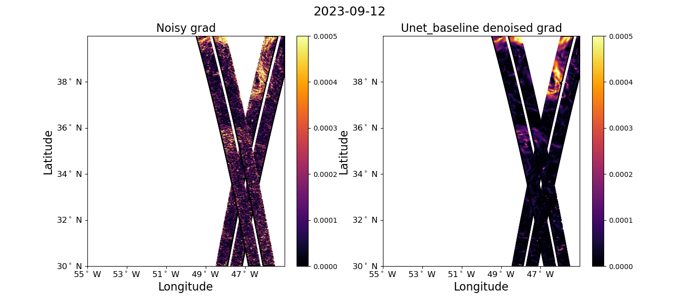
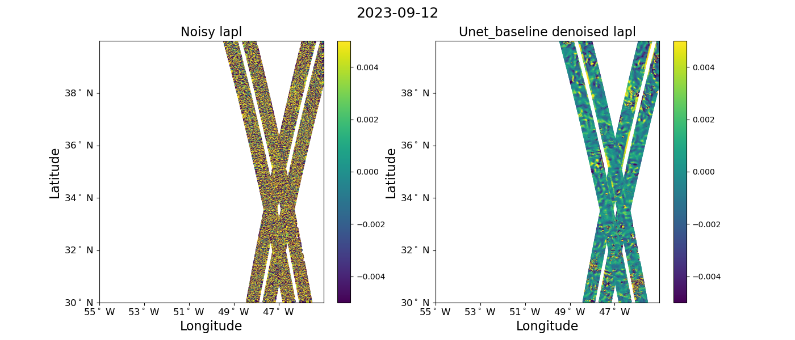

# Snap shots

 
 
Check the [demo notebook](https://github.com/ocean-data-challenges/2024b_DC_SWOTdenoising/blob/main/notebooks_demos/demo_readandplot_swot.ipynb) on GitHub. 

 
 
 

## 1 day orbit - Gulf Stream example

**SSH**

**Gradients of SSH**

**Laplacian of SSH** 

## 21 day orbit - Gulf Stream example
 
**SSH**

**Gradients of SSH** 

**Laplacian of SSH** 

  
 
 
 
 