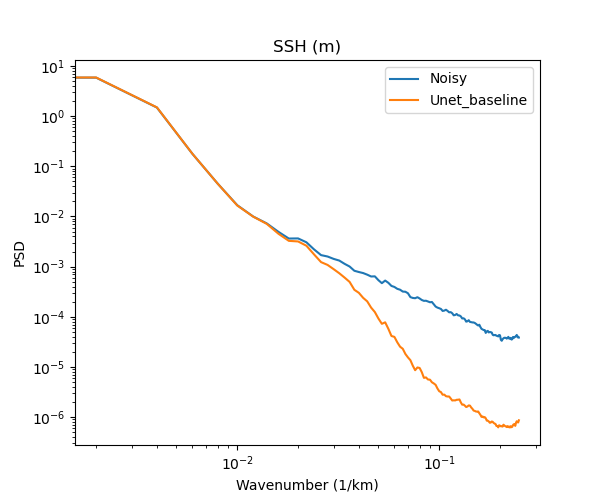
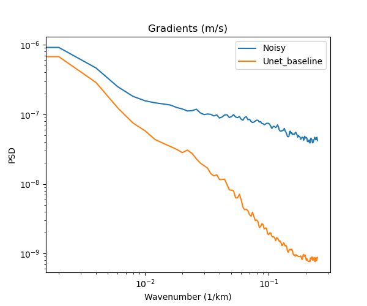

# Power Spectrum Density

 
 

 

## 1 day orbit - Gulf Stream example

**SSH**

**Gradients of SSH**

**Laplacian of SSH** 

## 21 day orbit - Gulf Stream example
 
**SSH**

**Gradients of SSH** 

**Laplacian of SSH** 

  
 
 
 
 